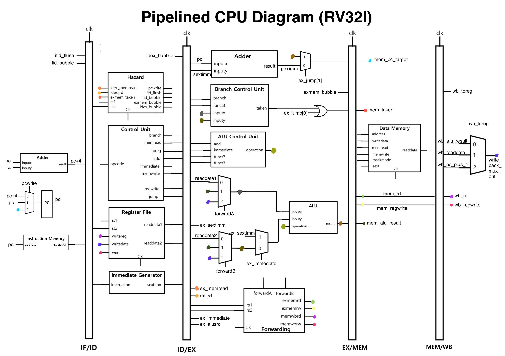

# Pipelined_CPU_RISC-V
 Pipelined CPU for RISC-V architecture(RV32I)


[Pipelined CPU Diagram]

This is a pipelined CPU for RV32I base integer instructions written in Verilog HDL. Data/control flow hazard detection/resolution are both implemented. For data flow hazard resolution forwarding(register bypassing) was used. Branch is always not taken by default but when taken pipeline registers are flushed. The code has also been tested with a simple Fibonacci function written in C translated into assembly instructions.


## How to test the code
```
> make
> python3 test.py
```