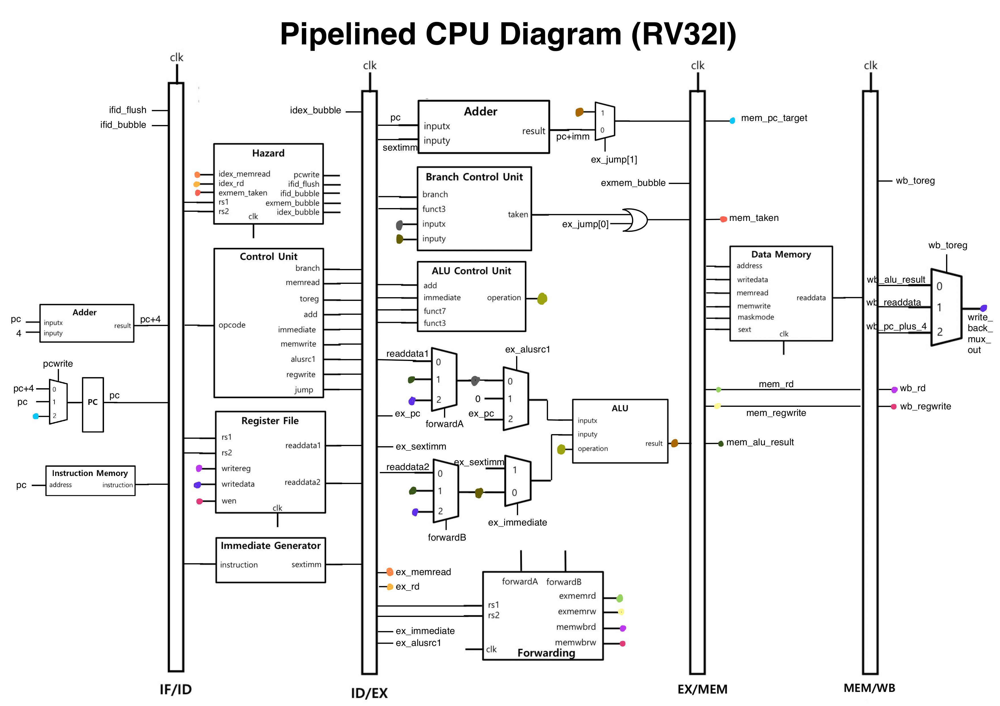

# Pipelined_CPU_RISC-V
 Pipelined CPU for RISC-V microarchitecture


[Pipelined CPU Diagram]

This is a Pipelined CPU for RV32I base integer instructions written in Verilog HDL. Data/control flow hazard detection/resolution are both implemented. The branch is always not taken by default but resolved when taken. The code has been tested with a simple Fibonacci function written in C translated into assembly instructions.


## How to test the code
```
> make
> python3 test.py
```